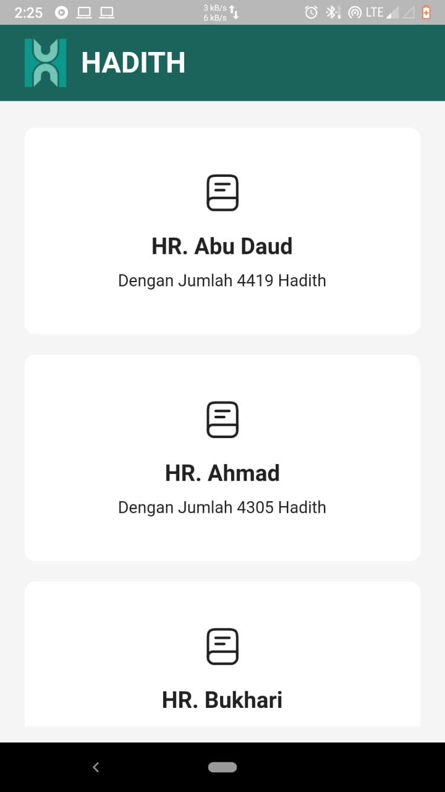
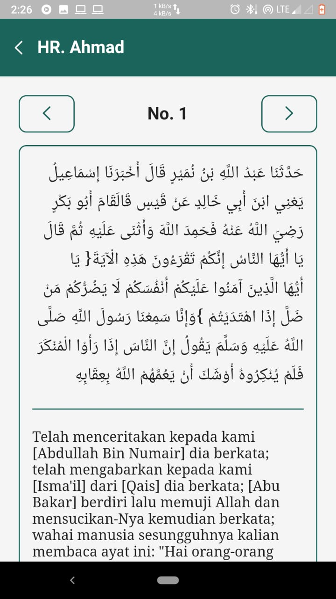

# Kumpulan Hadith

Merupakan aplikasi yang menyediakan kumpulan hadith dari beberapa perawi. Aplikasi ini dibagun menggunakan Framework Flutter

### Dart Package

- quatable: ^2.0.3
- flutter_riverpod: ^0.14.0+3
- http: ^0.13.3

### Font Icon

- Iconsax by: https://iconsax.io/

### Design

Referensi design by Naima Zulfa - https://www.figma.com/file/GWyYqagCo5AYgCsJXrJiPg/WebHadits?node-id=0%3A1

### API Hadith

Rest API: https://api.hadith.sutanlab.id/books/

### Todos

<input type="checkbox" checked>Home & Detail Page</input>  
<input type="checkbox">Control Page (Next/Previous)</input>  
<input type="checkbox">Search Hadith by Number</input>  
<input type="checkbox">Dark Mode</input>  

### Screenshoot

